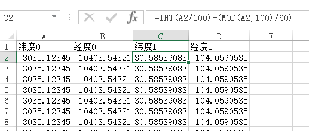

GPS模块输出的数据是NMEA格式，其中GPGGA字段包含我们需要的经纬度信息。

例：  
`$GPGGA,092204.999,4250.5589,S,14718.5084,E,1,04,24.4,12.2,M,19.7,M,,0000*1F`  
其中 4250.5589,S,14718.5084,E 就是经度和纬度数据，其格式是

纬度：ddmm.mmmmm（度分）

经度：dddmm.mmmmm（度分）

google Earth Pro是免费、强大的地图工具，它支持导入包含经纬度的csv文件，用来描点，使我们更直观的看gps的定位信息。

但是google Earth Pro中需要dd.ddddd格式的经纬度，所以我们要将ddmm.mmmm转换成dd.ddddd。

转换公式 dd.ddddd = dd + mm.mmmm/60。

首先将NMEA数据中的经纬度数据提取出来，导入到csv文件中，再利用excel工具转换格式，转换公式为 `=INT(A2/100)+(MOD(A2,100)/60)`

再在google Earth Pro中导入csv文件。
即可描出点和路径。
