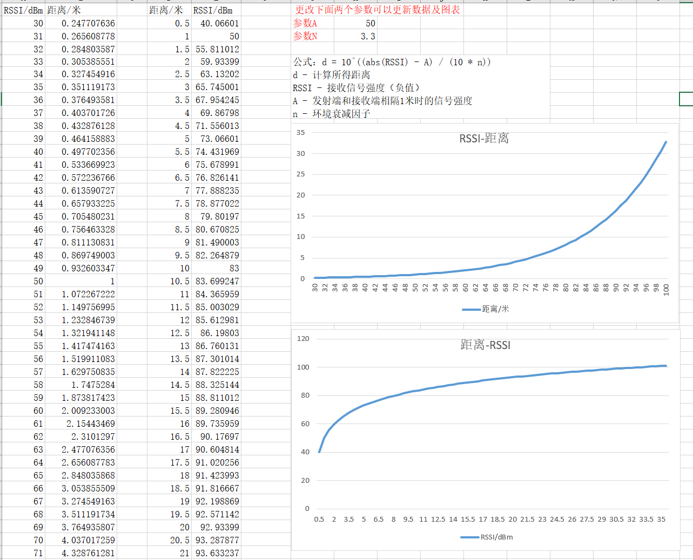

RSSI是无线接收的信号强度指示，如WIFI、BLE、ZigBee。接收到的RSSI的强弱与发射点与接收点的距离有一定的关系，故可以依据RSSI进行粗略的定位计算，如苹果的iBeacon。
其中用到最重要的就是RSSI转距离算法，具体的转换曲线可以根据实际测量数据拟合，也可直接使用通用公式。
通用的RSSI转距离公式为：
```
d = 10^((abs(RSSI) - A) / (10 * n))
d - 计算所得距离
RSSI - 接收信号强度（负值）
A - 发射端和接收端相隔1米时的信号强度
n - 环境衰减因子
```
其中A与n参数需要我们结合实际情况调整，整理出一个excel工具，可以直观的调节参数，看到调节后的曲线图。   


下载文件：[蓝牙RSSI转距离计算工具.xlsx](蓝牙RSSI转距离计算工具.xlsx)
